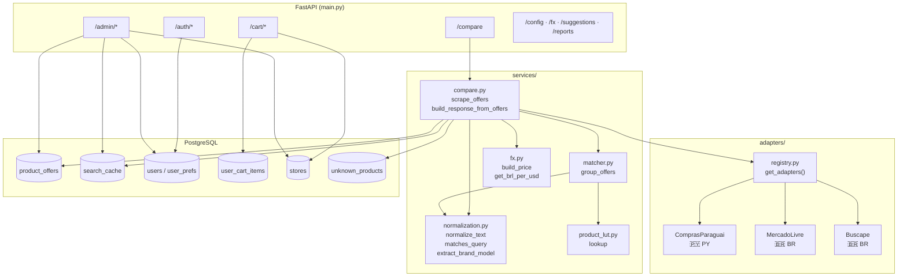
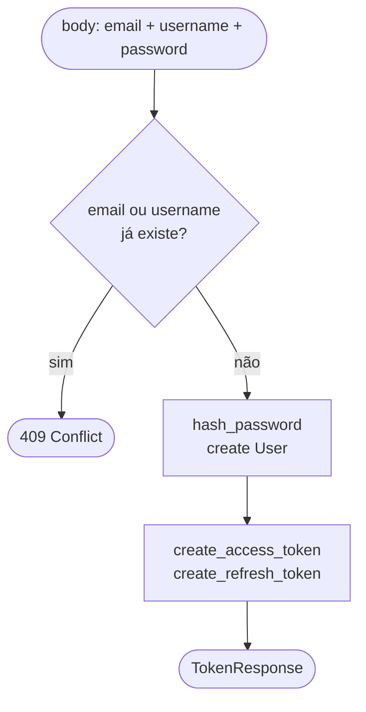
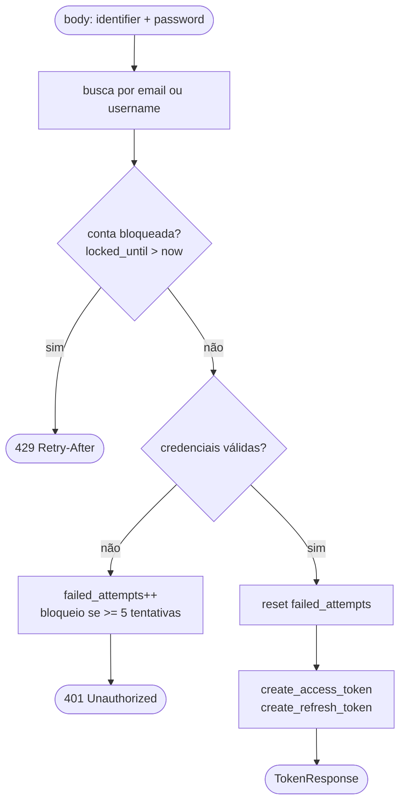
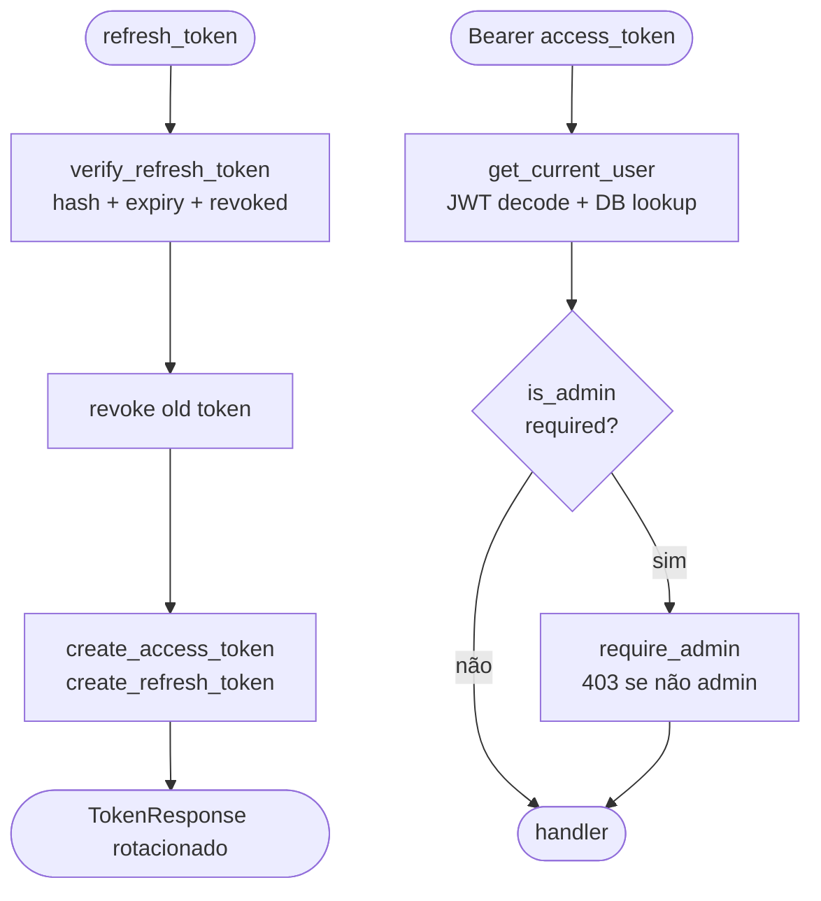
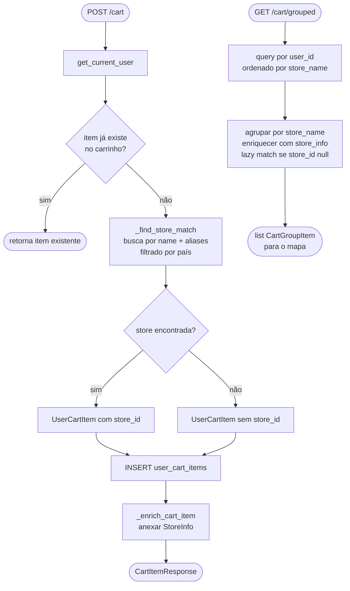

# Backend Flows

## Arquitetura de módulos



---

## Fluxo principal — `/compare`

```mermaid
flowchart TD
    A([Client GET /compare?q=...]) --> B[normalize_text query]
    B --> C[_load_db_offers\nproduct_offers WHERE expires_at > now\n+ matches_query filter]

    C --> D{country == all?}

    D -- sim --> E[run PY adapters\nComprasParaguai]
    E --> F[_br_queries_from_py_offers\nLUT lookup → canonical names\nstrip SKU/storage/bundle]
    F --> G[run BR adapters\nMercadoLivre + Buscape\npor query derivada]
    G --> H[py_offers + br_offers]

    D -- não --> I[run adapters\nfiltrado por país]
    I --> H

    H --> J[Merge db_offers + live_offers\nlive wins on URL conflict]
    J --> K[Attach store_info\nbatch lookup stores + aliases]
    K --> L{live_offers?}

    L -- sim --> M[_upsert_offers → product_offers\nupsert on url conflict]
    M --> N[_purge_expired\ndelete expired offers + cache]
    N --> O

    L -- não --> O[update search_cache\nhit_count++ ou INSERT]
    O --> P{usuário logado?}
    P -- sim --> Q[_save_user_search\nupsert + trim 50 recentes]
    Q --> R
    P -- não --> R[group_offers\nLUT match → ProductGroupModel]
    R --> S[_compute_cheapest\n_compute_preview_offers\n_select_group_image]
    S --> T([CompareResponseModel\nX-Cache: MISS | FALLBACK])

    style T fill:#2d6a4f,color:#fff
    style A fill:#1b4332,color:#fff
```

---

## Fluxo de autenticação

### POST /auth/register



### POST /auth/login



### POST /auth/refresh  ·  rotas protegidas



---

## Fluxo do carrinho


