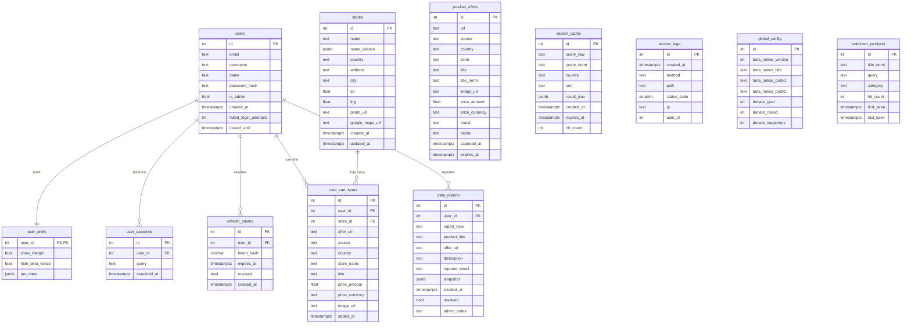

# Database Schema

## Índices e constraints notáveis

| Tabela | Índice / Constraint |
|---|---|
| `users` | `UNIQUE email`, `UNIQUE username` |
| `search_cache` | `INDEX (query_norm, country, sort, expires_at)` |
| `product_offers` | `UNIQUE url` · `INDEX (expires_at)` · `INDEX (country, title_norm)` |
| `user_cart_items` | `UNIQUE (user_id, offer_url)` · `INDEX user_id` |
| `refresh_tokens` | `UNIQUE token_hash` · `INDEX user_id` · `INDEX expires_at` |
| `data_reports` | `INDEX created_at` · `INDEX resolved` |
| `unknown_products` | `UNIQUE (title_norm, category)` · `INDEX (category, hit_count)` |

## Tabelas sem FK (standalone)

- **`search_cache`** — cache global de buscas, sem vínculo a usuário
- **`product_offers`** — catálogo de ofertas scrapeadas
- **`access_logs`** — log HTTP (Marco Civil art. 15 — retenção 6 meses)
- **`global_config`** — singleton row de configuração do app
- **`unknown_products`** — fila de produtos sem match na LUT
